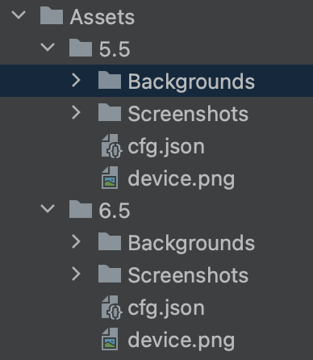

# ScreenShotGenerator
Utility to layer screenshots in device bezels on custom backgrounds for use on app stores.
## How to Use
The utility relies on a folder structure and configuration files to combine the necessary assets. Run `main.py` with no arguments to generate screenshots for all of the devices and images inputted.
## Folder Structure
1. `Assets` folder in the root of the project
2. `Device` folers (named acording to size)
3. Each device requires a `Backgrounds` folder, `Screenshots` folder, a `cfg.json` file, and a `device.png` bezel image.



### Background and Screenshot Images
Each background image should be a `png` numbered in order of how you would like them generated.

### Device bezel image
iOS device bezels can be found [here](https://developer.apple.com/design/resources/) and should be renamed to `device.png`.

## Configuration
```
{
  "screenshot": {
    "offset_x": 115,
    "offset_y": 80
  },
  "background": {
    "offset_x": 150,
    "offset_y": 100
  },
  "text": {
    "top": 100,
    "font": "Inter.ttf",
    "size": 100
  },
  "labels": ["Hello World"],
  "width": 1242,
  "height": 2205
}
```
### Screenshot
To change where in the device the screenshot is placed, use the x and y offset options to align. They are centered in the top left corner.

### Background
To change where in the background the device is placed, use the x and y offset options to align. They are centered in the bottom left corner.

### Text
The text takes a top margin, `ttf` file path (Arial.ttf and Inter.ttf provided), and a font size.

### Labels
List of the headings in order.

### Output Resolution
Set the output height and width using `width` and `height` for each `cfg.json`.

## Output
The images are output in the `Export` folder categorized by device name.
